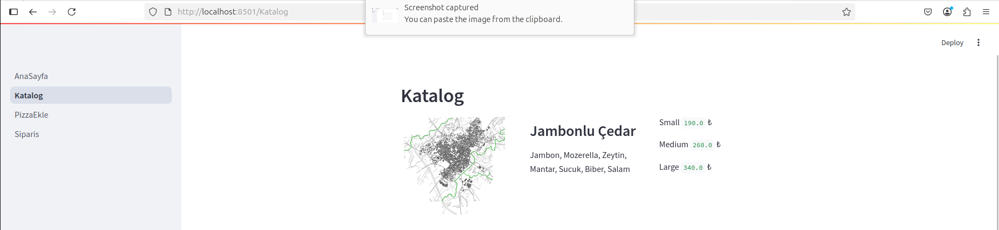
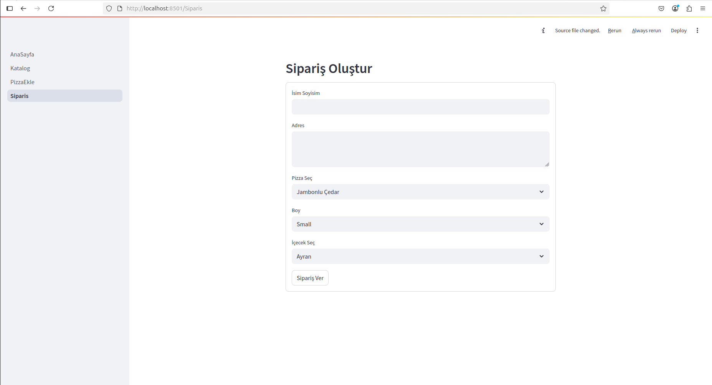
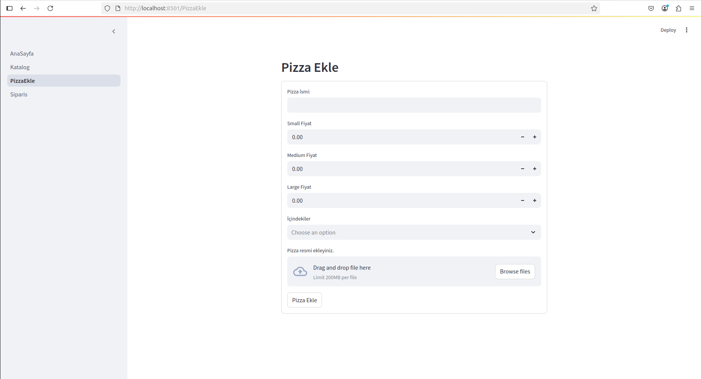

# Pizza Teslimat Uygulaması

Bu proje, Streamlit kullanılarak geliştirilmiş basit bir pizza sipariş ve yönetim uygulamasıdır. Kullanıcılar pizzaları inceleyebilir, sipariş verebilir ve yöneticiler yeni pizza çeşitleri ekleyebilirler.

## Özellikler

* **Ana Sayfa:** Uygulamanın genel tanıtımı ve hoş geldin mesajı.
* **Pizza Kataloğu:** Mevcut pizzaların isimleri, içindekileri, fiyatları (Small, Medium, Large) ve görselleri.
* **Sipariş Oluşturma:** Kullanıcıların isim, adres, seçilen pizza, boy ve içecek bilgileriyle sipariş verebilmeleri.
* **Pizza Ekleme:** Yöneticilerin yeni pizza çeşitlerini isimlendirip, fiyatlarını belirleyip, içindekilerini seçip ve görsel ekleyerek sisteme dahil edebilmeleri.

## Teknolojiler

* **Python:** Uygulamanın temel programlama dili.
* **Streamlit:** Web arayüzü oluşturmak için kullanılan kütüphane.
* **SQLite3:** Pizza ve sipariş bilgilerini depolamak için kullanılan hafif veritabanı.

## Kurulum ve Çalıştırma

Bu projeyi yerel makinenizde çalıştırmak için aşağıdaki adımları izleyin:

1.  **Projeyi Klonlayın:**
    ```bash
    git clone [https://github.com/mustafaemirata/PizzaDelivery.git](https://github.com/mustafaemirata/PizzaDelivery.git)
    cd PizzaDelivery
    ```

2.  **Sanal Ortam Oluşturun ve Aktive Edin (Önerilir):**
    ```bash
    python -m venv .venv
    # Windows
    .venv\Scripts\activate
    # macOS/Linux
    source .venv/bin/activate
    ```

3.  **Gerekli Kütüphaneleri Yükleyin:**
    ```bash
    pip install streamlit
    ```
    *Eğer başka kütüphaneler kullanıyorsanız, onları da bu adıma eklemelisiniz. Örneğin, `pip install sqlite3` gerekmez çünkü `sqlite3` Python'ın standart kütüphanesindedir.*

4.  **Uygulamayı Çalıştırın:**
    Ana uygulamanızın olduğu dosyanın adını kullanarak Streamlit'i başlatın. Örneğin, `AnaSayfa.py` ana dosyanız ise:
    ```bash
    streamlit run AnaSayfa.py
    ```
    Bu komut, uygulamanızı varsayılan web tarayıcınızda açacaktır.

## Proje Yapısı
├── AnaSayfa.py
├── Katalog.py
├── PizzaEkle.py
├── Siparis.py
├── pizzadb.sqlite3
└── img/  
## Ekran Görüntüleri

*Örnek olarak, projenizin görsellerini burada gösterebilirsiniz. Görseldeki gibi `ProjeResimleri/Katalog.png` şeklinde bir yol kullanıyorsanız, bu dizinin ve resmin var olduğundan emin olun.*




